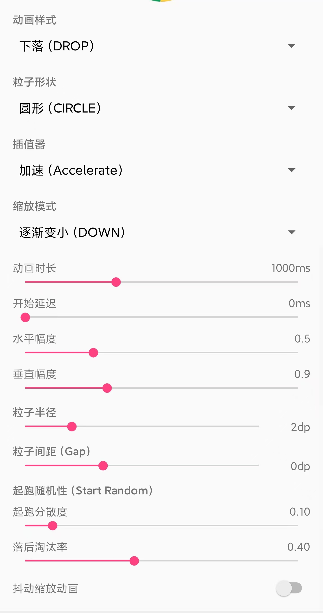

# ParticleSmasher

[](https://jitpack.io/#tombcato/ParticleSmasher)
[](http://www.apache.org/licenses/LICENSE-2.0)
[](https://github.com/tombcato/ParticleSmasher/releases)

**中文** | [English](README_EN.md)

一个强大且深度优化的 Android 粒子破碎效果库。它可以将任何 View “粉碎”成n个粒子。非常适合用于删除动画、转场效果或任何令人解压的视觉交互。fork自 [ParticleSmasher](https://github.com/ifadai/ParticleSmasher) 进行了诸多优化


## 📖 目录 (Index)

- [✨ 功能特性](#-功能特性)
- [🚀 性能优化 (v2.0)](#-性能优化-v20)
- [📦 安装指南](#-安装指南)
- [💻 使用方法](#-使用方法)
    - [基础用法](#基础用法)
    - [进阶配置](#进阶配置)
    - [工具方法](#工具方法)
- [🎨 样式与配置](#-样式与配置)
    - [动画样式](#动画样式-setstyle)
    - [缩放模式](#缩放模式-setscalemode)
- [📄 开源协议](#-开源协议)

## ✨ 功能特性

- **10 种核心动画**：爆炸、下落、四个方向的飘落、四个方向的向上飘散。
- **高度可定制**：自由控制动画时长、粒子大小、形状、扩散范围等。
- **流式 API**：Builder 风格的链式调用，代码整洁易读。
- **视觉特效**：
    - **缩放模式**：粒子可以在运动中缩小、放大或保持不变。
    - **密度控制**：调整粒子间距，支持稀疏或高密度（重叠）效果。
    - **智能随机性**：可配置起飞延迟和消失透明度的随机性，让效果更自然。
- **多场景支持**：完美支持 Activity、Fragment、Dialog 以及自定义 ViewGroup，并自动管理单例和生命周期。
- **性能优化**：专为移动端优化，即使在高粒子数量下也能保持 60fps 流畅运行。

## 🚀 性能优化 (v2.0+)

ParticleSmasher v2.0+ 带来了重大的性能改进：
- **一维粒子数组**：从 `Particle[][]` 改为 `Particle[]`，提升缓存命中率，减少循环开销
- **硬件加速**：启用 `LAYER_TYPE_HARDWARE` 进行 GPU 渲染
- **智能脏区合并**：多动画脏区合并 + 超过 80% 覆盖率时自动全屏刷新
- **缓存优化**：每帧缓存 `getAnimatedValue()`，复用 `ThreadLocalRandom`
- **静态工厂模式**：`ParticleSmasher.get(Activity/Fragment/ViewGroup)` 配合 WeakHashMap 缓存
- **生命周期感知**：Activity/Fragment 销毁时自动清理资源
- **混淆规则**：包含 `consumer-rules.pro` 供使用者混淆配置
- **脏区刷新**：只重绘粒子包围盒区域，大幅减少 GPU 重绘压力
- **Alpha 预计算**：初始化时缓存，消除绘制循环中的重复调用
- **内存效率**：`CopyOnWriteArrayList` 保证线程安全

### 🛠 核心功能 & 修复 (Core & Fixes)
- **Gradle & AGP 升级** (Gradle 8.13, AGP 8.13.2)
- **AndroidX 迁移** (Support → AndroidX)
- **Java 17 支持**
- **关键 Bug 修复**
    - 修复动画位置漂移问题
    - 修复隐藏后点击无效问题 (reShowView)
    - **修复 View 未布局完成时崩溃问题** (width/height <= 0)
    - **修复局部可见 View 的动画裁切问题** (只渲染可见区域)
- **并发优化** (CopyOnWriteArrayList)

### ✨ 动画效果 (Animation Effects)
- **新动画效果** (向上飘散 Rise 系列)
- **粒子形状** (圆形/方形)
- **插值器选择** (支持自定义插值器)
- **抖动动画开关**
- **随机延迟范围配置**
    - `setStartRandomness()`: 控制粒子起跑的整齐度
    - `setEndRandomness()`: 控制粒子消失的随机性
- **粒子缩放模式** (Scale Mode)
    - `SCALE_DOWN`: 逐渐变小 (默认)
    - `SCALE_SAME`: 大小不变
    - `SCALE_UP`: 逐渐变大
- **粒子间距/密度控制** (Particle Gap)
    - `setParticleGap(int px)`: 允许设置正间距(稀疏)和负间距(重叠/高密度)

### 📱 Demo & UI
- **全功能控制面板** (配置所有参数)
- **配置保存与读取** (SharedPreferences)
- **沉浸式状态栏** (白色标题栏 + 黑色图标)
- **布局优化** (固定头尾，中间滚动)
- **多 View 并发动画演示** (Demo 支持同时对多个 View 执行粒子破碎)
## 📦 安装指南

### 第一步：添加 JitPack 仓库
在项目的根目录 `settings.gradle` (或项目级 `build.gradle`) 中：

```groovy
dependencyResolutionManagement {
    repositories {
        // ...
        maven { url 'https://jitpack.io' }
    }
}
```

### 第二步：添加依赖
在 app 模块的 `build.gradle` 中：

```groovy
dependencies {
    implementation 'com.github.tombcato:ParticleSmasher:v2.1.0'
}
```

## 💻 使用方法

### 基础用法

#### 1. Activity 绑定 (最常用)
支持整个 Activity 范围的动画（粒子可以飞到任何地方）。
```java
ParticleSmasher smasher = ParticleSmasher.get(this); // this is Activity
smasher.with(view).start();
```

#### 2. Fragment 绑定
支持 Fragment 内部的 View。
```java
// 在 Fragment 中
ParticleSmasher smasher = ParticleSmasher.get(this); // this is Fragment
smasher.with(view).start();
```

#### 3. ViewGroup 绑定
将粒子动画限制在某个容器内，或者用于 Dialog / PopupWindow。
```java
ParticleSmasher smasher = ParticleSmasher.get(viewGroup);
smasher.with(view).start();
```

### 进阶配置
定制动画的每一个细节：

```java
smasher.with(targetView)
    .setStyle(SmashAnimator.STYLE_RISE)        // 动画样式
    .setShape(SmashAnimator.SHAPE_CIRCLE)      // 粒子形状：圆形 (CIRCLE) 或 方形 (SQUARE)
    .setDuration(1500)                         // 动画时长 (毫秒)
    .setStartDelay(100)                        // 动画开始前的延迟
    .setHorizontalMultiple(3f)                 // 水平方向扩散倍数
    .setVerticalMultiple(4f)                   // 垂直方向扩散倍数
    .setParticleRadius(Utils.dp2Px(2))         // 粒子基础半径
    .setParticleGap(Utils.dp2Px(0))            // 粒子间距：<0 代表重叠(更密)，>0 代表稀疏
    .setScaleMode(SmashAnimator.SCALE_DOWN)    // 缩放模式：缩小(DOWN)、不变(SAME)、放大(UP)
    .setStartRandomness(0.1f)                  // 0.0 ~ 1.0: 起飞时间的随机性
    .setEndRandomness(0.5f)                    // 0.0 ~ 1.0: 消失透明度的随机性
    .setHideAnimation(true)                    // 开启“震动+缩小”隐藏原 View 的动画
    .addAnimatorListener(new SmashAnimator.OnAnimatorListener() {
        @Override
        public void onAnimatorEnd() {
            // 动画结束回调
        }
    })
    .start();
```
Demo:


### 工具方法

```java
// 检查某个 View 是否正在动画中
if (smasher.isAnimating(view)) { ... }

// 让被粉碎（隐藏）的 View 重新显示出来
smasher.reShowView(view);
```

## 🎨 样式与配置

### 动画样式 (`setStyle`)
| 常量名 | 描述 |
|:---|:---|
| `STYLE_EXPLOSION` | 粒子向四面八方爆炸（默认效果）。 |
| `STYLE_DROP` | 粒子受重力影响向下坠落。 |
| `STYLE_RISE` | 粒子像烟雾/魔法一样向上飘散。 |
| `STYLE_FLOAT_LEFT` | 向右侧飘落。 |
| `STYLE_FLOAT_RIGHT`| 向左侧飘落。 |
| `STYLE_FLOAT_TOP`  | 向下方飘落（分层效果）。 |
| `STYLE_FLOAT_BOTTOM`| 向上方飘落（分层效果）。 |
| ... | (以及 Rise 的各个方向变种) |

### 缩放模式 (`setScaleMode`)
| 常量名 | 描述 |
|:---|:---|
| `SCALE_DOWN` | 粒子随时间缩小（默认）。适合碎片、残渣效果。 |
| `SCALE_SAME` | 粒子保持大小不变。 |
| `SCALE_UP` | 粒子随时间放大。适合烟雾、气泡或魔法效果。 |

## 📄 开源协议

```
Copyright 2026 TombCato

Licensed under the Apache License, Version 2.0 (the "License");
you may not use this file except in compliance with the License.
You may obtain a copy of the License at

   http://www.apache.org/licenses/LICENSE-2.0

Unless required by applicable law or agreed to in writing, software
distributed under the License is distributed on an "AS IS" BASIS,
WITHOUT WARRANTIES OR CONDITIONS OF ANY KIND, either express or implied.
See the License for the specific language governing permissions and
limitations under the License.
```
